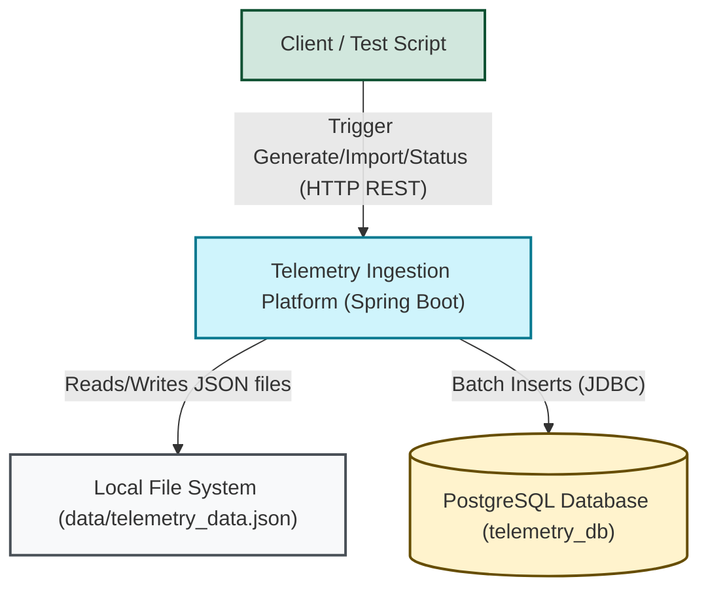
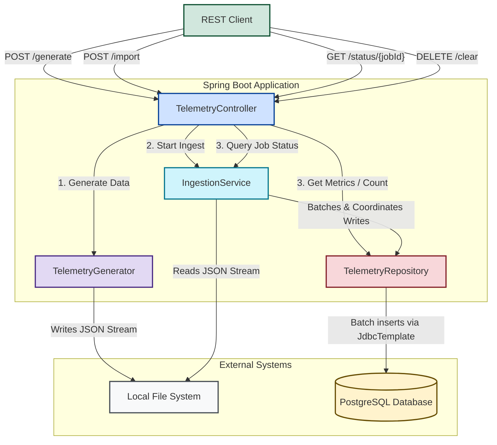

# 🏗️ Architecture Documentation - Telemetry Ingestion Platform

This document describes the high-level design, system boundary, and internal components of the Telemetry Ingestion Platform.

---

## 🗺️ Level 1: System Context (L1)

The System Context diagram illustrates the boundaries of the Telemetry Ingestion Platform, showing how external actors and systems interact with it.



### Actors & Systems

1. **Client / Test Script**: A developer, QA, or automated test script that interacts with the system using HTTP REST endpoints to run benchmarks, inspect job state, or reset the environment.
2. **Telemetry Ingestion Platform**: The core application built with Java 25 and Spring Boot. It orchestrates the generation of Mock Telemetry data and ingestions.
3. **Local File System**: Stores the massive telemetry JSON file (`data/telemetry_data.json`) generated by the service and read by the ingestion engine.
4. **PostgreSQL Database**: A persistent storage instance holding the ingested telemetry records. It handles high-concurrency writes across up to 45 connections.

---

## 🧱 Level 2: Component Diagram (L2)

The Component diagram shows the internal structure of the Spring Boot application, detailing how classes interact with each other, the file system, and the database.



### Component Breakdown

#### 1. [TelemetryController](file:///Users/vasanthbalakrishnan/Studies/antigravity/file-concurrency-test/src/main/java/com/example/file_concurrency_test/controller/TelemetryController.java)
- **Role**: Exposes the REST API surface.
- **Responsibilities**:
  - Validates API inputs (e.g., generation count, batch size).
  - Triggers asynchronous ingestion jobs.
  - Queries active and past jobs and combines them with database metrics.
  - Exposes administrative utilities (database truncation and file deletion).

#### 2. [TelemetryGenerator](file:///Users/vasanthbalakrishnan/Studies/antigravity/file-concurrency-test/src/main/java/com/example/file_concurrency_test/service/TelemetryGenerator.java)
- **Role**: JSON mock data generator.
- **Responsibilities**:
  - Generates flat JSON files containing pseudo-random telemetry records.
  - Employs Jackson's `JsonGenerator` writing directly to a `BufferedOutputStream`.
  - Avoids building object graphs in memory, allowing gigabytes of test data to be generated with minimal JVM heap footprint.

#### 3. [IngestionService](file:///Users/vasanthbalakrishnan/Studies/antigravity/file-concurrency-test/src/main/java/com/example/file_concurrency_test/service/IngestionService.java)
- **Role**: Ingestion orchestration and concurrency coordinator.
- **Responsibilities**:
  - Manages the lifecycle of ingestion jobs (creating, starting, tracking).
  - Reads JSON stream using `JsonParser` on a primary virtual thread.
  - Assembles records into batches.
  - Submits batches to a Virtual Thread executor (`Executors.newVirtualThreadPerTaskExecutor()`).
  - Implements **Backpressure** via a `Semaphore` matching the database connection pool size to prevent connection exhaustion.

#### 4. [TelemetryRepository](file:///Users/vasanthbalakrishnan/Studies/antigravity/file-concurrency-test/src/main/java/com/example/file_concurrency_test/repository/TelemetryRepository.java)
- **Role**: High-speed database persistence layer.
- **Responsibilities**:
  - Dynamically builds the parameterized SQL statement for 146 metrics during post-construct initialization.
  - Uses `JdbcTemplate.batchUpdate()` with a custom `BatchPreparedStatementSetter` for maximum insert performance.
  - Coordinates table counts, truncation, and data sampling.

---

## 🗃️ Data Model & Schema Details

Each telemetry record comprises a header (ID, Device ID, Timestamp, Status) and an array of 146 double metrics.

### Domain Object: [TelemetryRecord](file:///Users/vasanthbalakrishnan/Studies/antigravity/file-concurrency-test/src/main/java/com/example/file_concurrency_test/model/TelemetryRecord.java)
- `UUID id`: Globally unique identifier.
- `String deviceId`: Format `DEV-XXXX`.
- `LocalDateTime timestamp`: Generation time.
- `String status`: `OK`, `WARNING`, or `CRITICAL`.
- `double[] metrics`: Array of 146 double values representing sensor metrics.

### Database Table: `telemetry_records`
```sql
CREATE TABLE telemetry_records (
    id UUID PRIMARY KEY,
    device_id VARCHAR(255) NOT NULL,
    timestamp TIMESTAMP NOT NULL,
    status VARCHAR(50),
    metric_1 DOUBLE PRECISION,
    metric_2 DOUBLE PRECISION,
    ...
    metric_146 DOUBLE PRECISION
);
```
*Note: Storing each metric in its own column allows indexing and rapid query analysis on specific metrics, but requires efficient, wide-insert queries during ingestion.*
