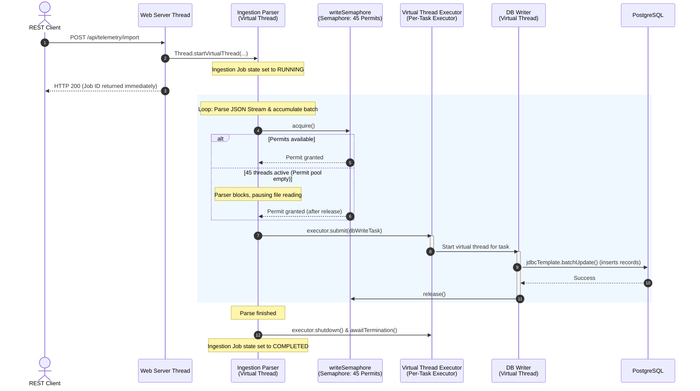

# ⚙️ Concurrency Model - Telemetry Ingestion Platform

This document describes the concurrent architecture of the ingestion engine, illustrating how virtual threads, semaphores, and database connection pools coordinate to process data at scale.

---

## 🧵 Thread Execution Flow

The platform relies on Java Virtual Threads for non-blocking execution. Below is a sequential visualization of the thread interactions during an ingestion job.



---

## ⚓ Backpressure & Semaphore Mechanics

Database connections are physical resources. In contrast, virtual threads are logical resources that are cheap to create. If the JSON parser generated write tasks without limits, the database connection pool would quickly saturate, causing write timeouts and OOM errors from buffered batches waiting in memory.

### The Semaphore Throttle
In `IngestionService`, we implement a `Semaphore` to govern database writing tasks:

```java
private static final int MAX_CONCURRENT_WRITES = 45; 
private final Semaphore writeSemaphore = new Semaphore(MAX_CONCURRENT_WRITES);
```

#### How it works:
1. **Accumulation**: The parser thread parses elements sequentially from the file stream until it reaches the defined `batchSize` (default: 1,000 records).
2. **Gating**: Before spawning the database write task on a virtual thread, the parser thread must execute:
   ```java
   writeSemaphore.acquire();
   ```
   If 45 threads are already performing write operations, the permit pool is exhausted. The parser thread suspends. It releases its underlying carrier thread, consuming virtually zero CPU while waiting.
3. **Execution**: When a permit is available, the parser thread acquires it, decrements the semaphore counter, and submits the batch to `Executors.newVirtualThreadPerTaskExecutor()`. The parser thread immediately continues parsing the next 1,000 records.
4. **Completion**: Inside the database writer's task block, when the `batchUpdate` finishes (either successfully or with an error), the thread executes:
   ```java
   } finally {
       job.getActiveWriteThreads().decrementAndGet();
       writeSemaphore.release();
   }
   ```
   This increments the permit count and instantly resumes the parsing thread if it was suspended.

---

## 🔌 Database Connection Coordination

The system leverages **HikariCP** as its connection pooling manager. To prevent thread starvation and application hangs, the semaphore count is coordinated with the connection pool size:

| Property / Parameter | Value | Description |
|---|---|---|
| `spring.datasource.hikari.maximum-pool-size` | **50** | Maximum connections PostgreSQL can handle from this instance. |
| `MAX_CONCURRENT_WRITES` (Semaphore) | **45** | Maximum concurrent insert tasks permitted by the ingestion engine. |
| **Reserved Connections** | **5** | Connections reserved for HTTP endpoints (monitoring, sampling, active count queries). |

By maintaining a gap between the write semaphore permits (45) and the Hikari pool size (50), we guarantee that HTTP GET requests (like `/api/telemetry/status` and `/api/telemetry/sample`) always find a free connection immediately. This prevents the dashboard or monitoring script from freezing during heavy ingestions.

---

## 📊 Concurrent State Tracking

Ingestion metrics must be updated dynamically as virtual threads run concurrently. To avoid lock contention and synchronization bottlenecks, all metrics are stored using thread-safe, non-blocking atomic classes in the `IngestionJob` inner class:

- **`AtomicLong recordsRead`**: Incremented by the parsing thread as tokens are read.
- **`AtomicLong recordsWritten`**: Incremented by database writer threads on successful batch persistence.
- **`AtomicLong writeTimeMs`**: Aggregates total database write times across threads using non-blocking updates.
- **`AtomicInteger activeWriteThreads`**: Tracked using atomic increments and decrements, reflecting the active semaphore occupancy.
