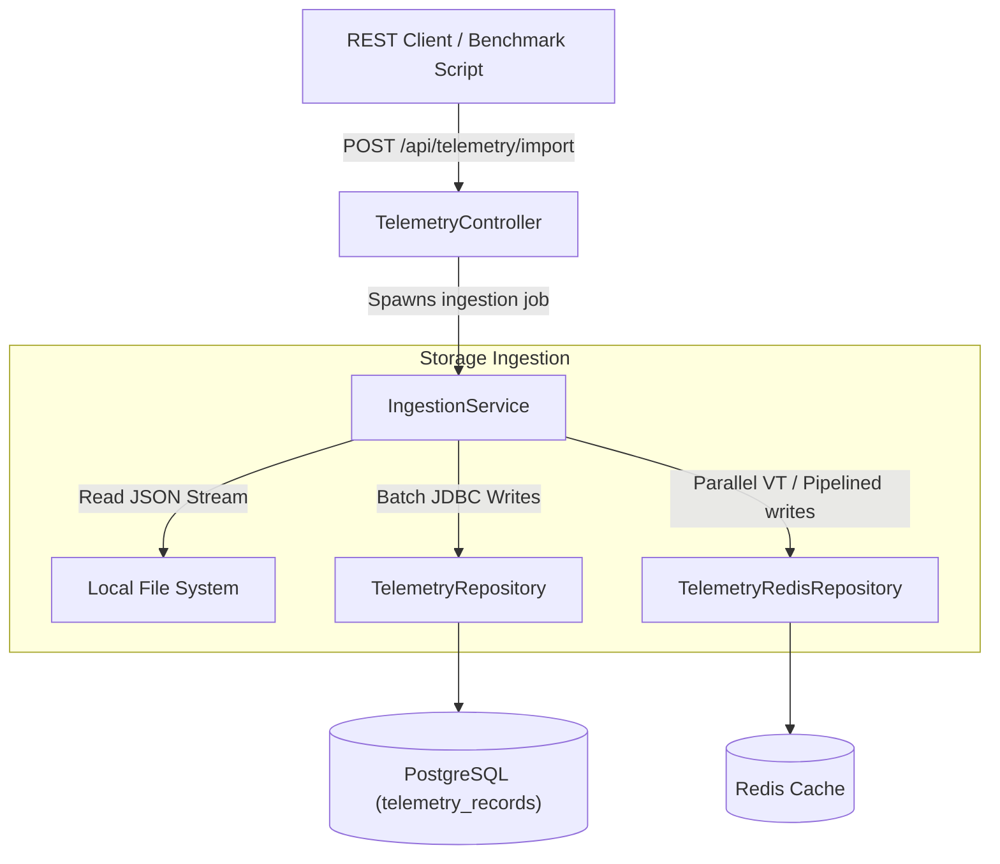

# 🚀 Telemetry Ingestion Platform - Concurrency & Performance Benchmarking

A high-performance Java 25 & Spring Boot application built to test massive telemetry ingestion workloads. It utilizes Java Virtual Threads, streaming JSON parsing, and semaphore-based backpressure to stream and write data concurrently to PostgreSQL and Redis.

---

## 📋 Overview & Core Capabilities

This platform is a reference implementation for handling high-throughput, concurrent writes under strict resource constraints. It includes:

*   **⚡ Non-Blocking Virtual Threads**: Leverages JDK 25 virtual threads via `newVirtualThreadPerTaskExecutor` to scale parallel writes without heavy OS thread overhead.
*   **💾 Multi-Target Storage**: Supports writing to **PostgreSQL** (wide table with 146 columns representing sensor metrics) and/or **Redis** (as serialized JSON records).
*   **📊 JSON Streaming Parser**: Processes gigabytes of test telemetry data using Jackson's `JsonParser` with a flat $O(1)$ memory footprint, preventing heap exhaustion.
*   **⚓ Bounded Semaphore Backpressure**: Matches ingestion thread activity to downstream capacities to prevent database connection pool exhaustion.
*   **🧪 Autonomous BDD Testing**: Features a comprehensive Cucumber BDD test suite and an autonomous test generation script utilizing the Google Antigravity SDK.

---

## 🏗️ Architecture & Component Mapping

The system follows a lightweight, reactive-dispatch design.



For in-depth explanations of Level 1 (System Context) and Level 2 (Components) diagrams, refer to [ARCHITECTURE.md](ARCHITECTURE.md).

### 🛠️ Technology Stack

| Component | Technology | Version | Description |
| :--- | :--- | :--- | :--- |
| **JDK** | Java | `25` | Utilizing virtual threads and modern pattern matching |
| **Framework** | Spring Boot | `4.0.6` | Web API routing & dependency management |
| **Relational DB** | PostgreSQL | `16-alpine` | Wide-table storage with 146 double-precision columns |
| **In-Memory Cache** | Redis | `7-alpine` | High-speed cache for telemetry string key-values |
| **Build & Run** | Gradle | `Latest` | Build tooling |
| **JSON Parser** | Jackson | `2.x` | High-speed streaming token reader |
| **Testing** | JUnit 5 & Cucumber | `Latest` | Classic unit testing + BDD Gherkin specifications |

### 📂 Directory & File Structure

*   [TelemetryController.java](https://github.com/vasanthtcs2009/file-concurrency-test/blob/main/src/main/java/com/example/file_concurrency_test/controller/TelemetryController.java): Exposes REST API endpoints for data generation, ingestion, and live job status reporting.
*   [IngestionService.java](https://github.com/vasanthtcs2009/file-concurrency-test/blob/main/src/main/java/com/example/file_concurrency_test/service/IngestionService.java): Orchestrates streaming file-read loops, batches records, and distributes writes to concurrent virtual threads.
*   [TelemetryGenerator.java](https://github.com/vasanthtcs2009/file-concurrency-test/blob/main/src/main/java/com/example/file_concurrency_test/service/TelemetryGenerator.java): Generates synthetic mock data streams directly to disk with flat memory allocation.
*   [TelemetryRepository.java](https://github.com/vasanthtcs2009/file-concurrency-test/blob/main/src/main/java/com/example/file_concurrency_test/repository/TelemetryRepository.java): Direct `JdbcTemplate` repository generating optimized parameter arrays for database batch updates.
*   [TelemetryRedisRepository.java](https://github.com/vasanthtcs2009/file-concurrency-test/blob/main/src/main/java/com/example/file_concurrency_test/repository/TelemetryRedisRepository.java): Manages connections and batch writes to Redis using both parallel virtual thread writes and pipelining.
*   [TelemetryRecord.java](https://github.com/vasanthtcs2009/file-concurrency-test/blob/main/src/main/java/com/example/file_concurrency_test/model/TelemetryRecord.java): Domain object representing a single telemetry device entry with header metadata and 146 sensor double fields.

---

## 🚀 Getting Started

### 1. Spin Up Database & Cache
Bring up PostgreSQL and Redis services in the background using Docker Compose:
```bash
docker-compose -f docker-compose-service.yml up -d
```
*(To run with the full ELK and Prometheus monitoring stack, use `docker-compose.monitoring.yml`)*

### 2. Build the Application
Compile the classes and run tests to verify compilation:
```bash
./gradlew build
```

### 3. Start the Ingestion Platform
Run the Spring Boot application locally:
```bash
./gradlew bootRun
```
The endpoints will be available at `http://localhost:8080`.

---

## 📡 API Reference & Workflow

### Step 1: Generate Mock Telemetry Data
Create a local flat JSON file containing synthetic telemetry records.
*   **Endpoint**: `POST /api/telemetry/generate`
*   **Query Params**:
    *   `count` (default `50000`): Number of mock records to generate.
*   **Example**:
    ```bash
    curl -X POST "http://localhost:8080/api/telemetry/generate?count=100000"
    ```
*   **Response**:
    ```json
    {
      "filePath": "/app/data/telemetry_data.json",
      "fileSizeMb": 152.45,
      "durationMs": 4200,
      "message": "Generated 100000 records successfully"
    }
    ```

### Step 2: Trigger Concurrency Ingestion
Trigger an asynchronous job to parse the mock data file and ingest records into storage.
*   **Endpoint**: `POST /api/telemetry/import`
*   **Query Params**:
    *   `batchSize` (default `1000`): Accumulation size per concurrent write task.
    *   `target` (default `both`): Target storage database. Options: `postgres`, `redis`, `both`.
    *   `redisStrategy` (default `PARALLEL_VT`): Execution pattern when writing to Redis. Options: `PARALLEL_VT` (virtual threads in parallel per record), `PIPELINE` (Redis pipelined multi-write).
*   **Example**:
    ```bash
    curl -X POST "http://localhost:8080/api/telemetry/import?batchSize=2000&target=both&redisStrategy=PIPELINE"
    ```
*   **Response**:
    ```json
    {
      "jobId": "e2c3cf3e-7301-4be3-b9bc-9cb77353fefb",
      "status": "RUNNING",
      "batchSize": 2000,
      "fileSizeMb": 152.45,
      "target": "both",
      "redisStrategy": "PIPELINE"
    }
    ```

### Step 3: Check Job Metrics & Throughput
Poll the status of an active or completed ingestion job.
*   **Endpoint**: `GET /api/telemetry/status/{jobId}`
*   **Example**:
    ```bash
    curl "http://localhost:8080/api/telemetry/status/e2c3cf3e-7301-4be3-b9bc-9cb77353fefb"
    ```
*   **Response**:
    ```json
    {
      "jobId": "e2c3cf3e-7301-4be3-b9bc-9cb77353fefb",
      "status": "COMPLETED",
      "recordsRead": 100000,
      "recordsWritten": 100000,
      "activeWriteThreads": 0,
      "batchSize": 2000,
      "fileSizeMb": 152.45,
      "target": "both",
      "redisStrategy": "PIPELINE",
      "elapsedTimeMs": 12500,
      "throughputRecordsPerSec": 8000.00,
      "writeTimeMs": 11200,
      "redisWriteTimeMs": 3100,
      "dbRowCount": 100000,
      "redisRowCount": 100000,
      "errorMessage": null
    }
    ```

### Other Administrative Endpoints
*   **GET** `/api/telemetry/status`: Returns database row counts and status metadata for all jobs.
*   **GET** `/api/telemetry/sample`: Returns a sample array of up to 100 records currently in the PostgreSQL database.
*   **DELETE** `/api/telemetry/clear`: Truncates database tables, flushes Redis, and deletes the local data JSON file to reset the bench environment.
    ```bash
    curl -X DELETE "http://localhost:8080/api/telemetry/clear"
    ```

---

## 🔧 Tuning Parameters & Concurrency Controls

### Semaphore Backpressure vs. Hikari CP
A fast parser can read JSON elements faster than a database can write them. Without backpressure, submitting unbounded write tasks will exhaust the connection pool and balloon memory usage.

`IngestionService` implements a semaphore limit:
*   `MAX_CONCURRENT_WRITES = 100`: Controls the maximum concurrent write batches submitted to virtual threads.
*   `spring.datasource.hikari.maximum-pool-size = 50`: Captures the database connection limit.
*   *Note*: When concurrent write tasks exceed database connections, extra tasks block safely on virtual threads. Since virtual threads detach when waiting for connection acquisition, they do not consume OS threads.

For a detailed analysis of sequence diagrams and HikariCP connection reserves, see [CONCURRENCY_MODEL.md](CONCURRENCY_MODEL.md).

### Redis Ingestion Strategies
1.  **`PARALLEL_VT` (Parallel Virtual Threads)**: Maps each record in a batch to a single virtual thread that performs `redisTemplate.opsForValue().set(...)` synchronously.
2.  **`PIPELINE` (Redis Pipelining)**: Writes the entire batch to the network connection commands socket buffer at once, bypassing standard roundtrip latency. Recommended for larger batch sizes.

---

## 🧪 Testing Suite & Cucumber BDD

### Running Standard Tests
To run all unit tests and generate code coverage metrics (reports stored under `build/reports/jacoco/`):
```bash
./gradlew test
```

### BDD Cucumber Tests
The project features behavior-driven integration tests written in Gherkin feature files:
*   [telemetry_generation.feature](https://github.com/vasanthtcs2009/file-concurrency-test/blob/main/src/test/resources/features/telemetry_generation.feature): Validates Mock Data generation boundaries.
*   [telemetry_ingestion.feature](https://github.com/vasanthtcs2009/file-concurrency-test/blob/main/src/test/resources/features/telemetry_ingestion.feature): Simulates DB ingestion state machines (pending, running, complete, fail) and mocks database failures using Mockito spy beans.

The BDD suite is executed automatically alongside regular JUnit 5 tests. It is bound under `RunCucumberTest.java` and configured with `@MockitoSpyBean` in `CucumberSpringConfiguration.java`.

### Autonomous BDD Test Generator Agent
The repository includes an autonomous QA engineer script `bdd_agent.py` built on the Google Antigravity SDK.

To run the agent to automatically inspect code and generate feature/step definitions:
1.  Set your Gemini API Key:
    ```bash
    export GEMINI_API_KEY="your-api-key"
    ```
2.  Launch the agent targeting a Java class:
    ```bash
    python3 bdd_agent.py --file src/main/java/com/example/file_concurrency_test/service/IngestionService.java
    ```
